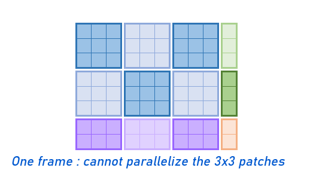
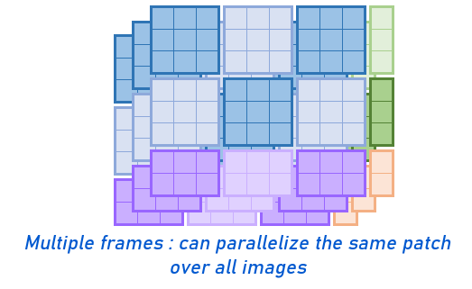

# Upscale
## Introduction
This work is derivated from the work of https://github.com/yu45020/Waifu2x that contains the main idea and the scripts I updated. you can find that I kept the models, the trained weights and lots of classes that were not made from me. However I improved the implementation to speed up the upscaling process compared to video2x that processes one image at a time we offer here a way to process as many images as your VRAM allows it: make some test and this will significantly speed up the process depending on the hardware that you have.
My goal here is to suggest a methodology to upscale your movie so that you can enjoy it at a higher quality especially if the higher resolution is not available, of course you can run these programs on any computer but without a cuda capable gpu you are going to wait a lot of time.

## Requirements
Running this program can not be made out of the box and requires some piece of hardware/software

* You need ffmpeg for dealing with the videos and extract the audio, the frames and build them back together afterwards
* You need [pytorch](https://pytorch.org/), if you don't have a cuda capable GPU, you can use the CPU version but it will be very slow
* (optionnal but very advised): a CUDA capable GPU with CUDA and Cudnn installed on it, if you have no idea on how to install all this, [here is a guide on how to install a linux environement with pytorch, cuda and cudnn](https://github.com/williampiat3/DeepLearningOnGamingLaptop)
* Depending on the movie you are upscaling you might need a lot of free space on your disk: 1 free Tb is a good start


## Principle
### What we suggest
The goal here is to increase the quality of a movie and therefore we will increase the quality of its frames and keeping the audio, the subtitles so here is how we are going to do it: First we will extract the audio, the subtitles and the frames from the movie, Then we will upscale the frames so as to increase teh quality of the movie, and finally we will merge all the upscaled frames back with the audio and the subtitles

### How is this different from other solutions
THere are mainly two differences between our solution and other upscaling softwares:
* We offer the possiblity to stop the upscaling whenever you want, as this is the longest operation you might want to have it running during the night or during free time but you might want to use the computer at some point for your daily use, we provide utility scripts in order to stop the calculation and resume where it left.
* On the other hand we process multiple frames at a times and use a multiprocessed reading and writting of the images, this might seem easy but the way the upscaling operation works makes it rather difficult to do therefore we see some major improvment in the upscaling process especially if you have a lot of VRAM. 

To put it shortly the images are cut into smaller patches of 70 pixels x 70 pixels before being processed through the network however not all the widths and heights are dividable by 70 therefore some patches are not 70x70 but smaller depending on which part of the frame they are located, Thus discarding the possibility to parallelize the processing of the patches of 1 images: But since the frames that you are using come from the same movie they will have the same size and therefore the same patches size. Here is a small example to show you the problem of parallelization with 3x3 patches on a 10x10 image and how we tackled it for a movie
<p align="center">
 
</p>
<p align="center">
 
</p>
This allows to process much faster the frames than the current solutions

## Steps

### Remove audio and subtitles
Use ffmpeg to extract the audio :
```
ffmpeg -i input-video.mp4 -vn -acodec copy output-audio.ogg
```
And the subtitles in case your file is an mkv
```
ffmpeg -i input-video.mkv -map 0:s:0 subs.srt
```
If you have multiple audio and sutitles in your file please refer to the documentation of ffmpeg as you will have to extract all the streams individually

### Extract all frames
Create a folder 'frames' and another inside it called 'class_1' where to put all the frames as there will be a lot of them, then run the following command:
```
ffmpeg -i input-video.mp4 frames/class_1/thumb%010d.png -hide_banner
```
This can take a while and this task is a CPU heavy task so make sure your PC is not in a overheated place, your fans should be enough for cooling it

### Upscale
Creare a folder that will recieve the upscaled images 'output' then open the test.py file in this github, change the input_path to specify the folder with the images, the output_path from the path of the folder where you'll be writting the images upscaled and the path of the weights of the model if you upscale images or cartoons, we recommand using locations on an SSD so as to improve I/O speed. You need to set the batch_size as high as your VRAM allows it, it will speed up the upscaling process a lot.

Then run the test.py program, this might take a while. The program writes every processed frames, this can give you a chance to see the overall progression or to stop the program and restart later.

### Stop the process and resume
This is optionnal but in order to stop the program and resume the computation where it stopped you simply have to move the images already done out of the 'frames/class_1' folder, we provide a python script called 'move_files.py' that checks the images already processed in the output folder and move the ones present in the input folder to the location you want, and then if you restart the test.py script it will resume where it left

### Build the video back and link the audio and subtitles
Find the framerate of the initial file:
```
ffmpeg -i filename
```
On the video stream you can have the fps (frame per second) you will need this information when building the video again

Once all frames were upscaled go to the output folder and use ffmeg to link them altogether in a movie and add the audio and subtitle streams, make sure to put the appropriate framerate
```
ffmpeg -framerate 24 -start_number 1 -i thumb%010d.png ../output.mp4
```
Note this method only works if you have a constant framerate for your initial video. Unconsistant framerate can lead to desynchronised audio.
To avoid this you can get [every individual frame times and merge them similary to the initial file](https://video.stackexchange.com/questions/24976/set-display-time-of-individual-frames-in-ffmpeg). Although this may increase merging time.
Just don't use the argument `-pix_fmt yuv420p` in the last command otherwise you will encode your video to Y'UV instead of RGB.

Add the audio 
```
ffmpeg -i output.mp4 -i output-audio.ogg -c copy -map 0:v:0 -map 1:a:0 output_with_sound.mp4
```

If your file is a mkv file you can add the subtitles you removed before
```
ffmpeg -i output_with_sound.mkv -i subs.srt -map 0 -map 1:s:0 output_with_subtitles.mkv
```
And that's it, a bit tedious but much more flexible than a software that you can run but it runs much faster, on a Geforce 1050 Ti Max Q it ran 3 times faster than video2X which is not neglictable when you are talking about hours or days of computation

## Conclusion
We provide here a more 'handcrafted' version of upscaling but it is customisable to any model, any movie and can be stopped and resumed at any time it is therefore a good solution to anyone who doesn't want to lock its computer for days and that want to enjoy a better quality on old movies or cartoons. You can check out our examples in the folders frames and results
<p align="center">
 
</p>

